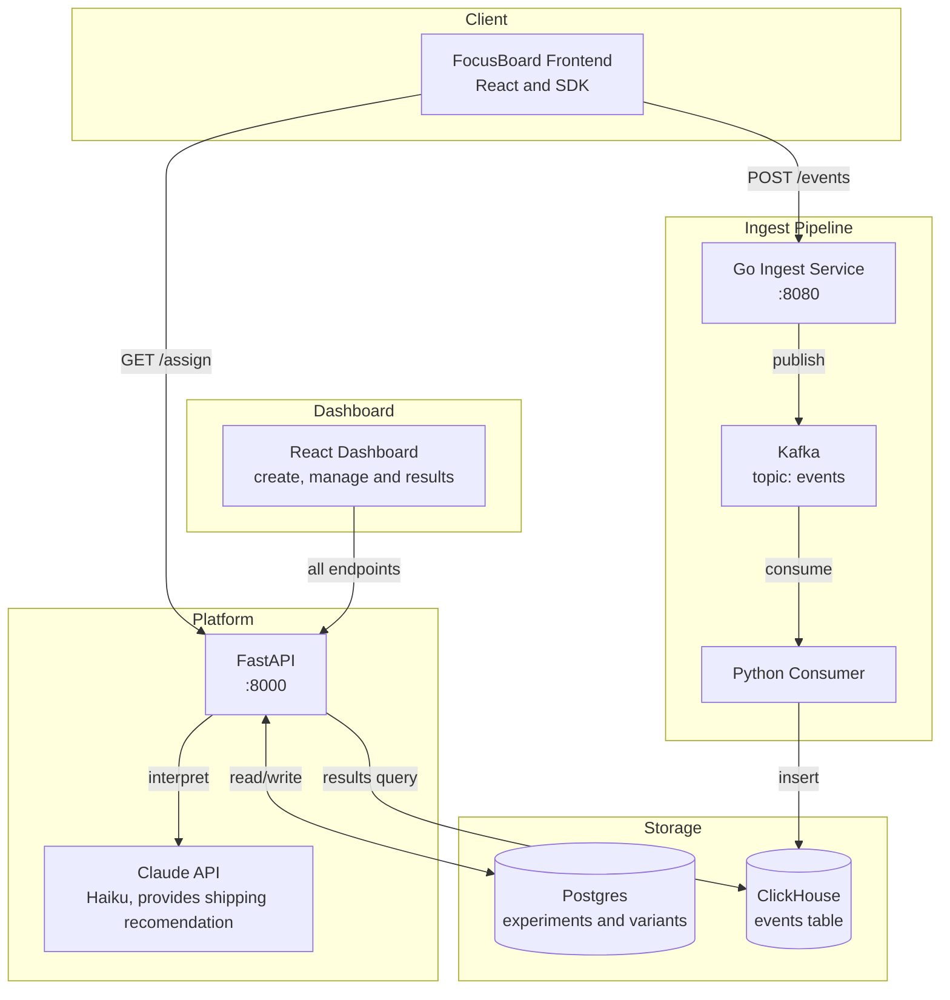

# AB Platform
A self-serve A/B experimentation platform built from scratch. Any app can integrate from the SDK to run experiments,  assign users to variants, track events at scale, and view statistically-analyzed results from an Al interpretation layer using Claude API.

Built to demonstrate distributed systems design: event streaming with Kafka, columnar analytics with ClickHouse, statistical significance testing, and LLM integration.

## Demo

[](https://youtu.be/aD53llQsRs8)

## Architecture

Data Flow: 
1. A user loads FocusBoard —> the SDK calls /assign to bucket them into a variant. A user will always get the same variant.
2. The SDK fires an exposure event to the Go ingest service, which validates and publishes it to Kafka
3. The Python consumer reads from Kafka and writes to ClickHouse
4. When the user converts based on the experiment criteria (I configured it to where the logs in or creates a habit), the SDK fires a conversion event through the same pipeline in #2
5. The dashboard queries FastAPI for the results, including Postgres for variant metadata, and ClickHouse for event counts.
6. Claude interprets the statistical results and returns a simple language recommendation on whether to ship or not

## Performance & Observability

The event pipeline was load-tested with 1,000,000 synthetic events at a concurrency of 100. It sustained 1,839 events per second with 100% delivery, zero failed requests, and 113 ms p95 HTTP latency.


The dashboard monitors ingestion and consumption throughput, Kafka consumer lag, stage-level p95 latency, consumer batch size, pipeline errors, CPU usage, and memory usage.

### Benchmark Results

| Workload | Throughput | p50 HTTP latency | p95 HTTP latency | Consumer catch-up | Delivery |
|---:|---:|---:|---:|---:|---:|
| 100K average (3 runs) | 2,142 events/s | 41 ms | 96 ms | 31 ms average | 100% |
| 250K | 1,778 events/s | 46 ms | 128 ms | 56 ms | 100% |
| 500K | 1,994 events/s | 43 ms | 106 ms | 29 ms | 100% |
| 1M | 1,839 events/s | 47 ms | 113 ms | 201 ms | 100% |

All listed benchmarks were completed with zero failed HTTP requests, zero observed Kafka publishing or ClickHouse insertion errors, and ensure alignment between accepted events and ClickHouse row counts. Peak Kafka consumer lag was 400 events across the full test series and 300 events during the 1M run.

### Methodology

Benchmarks were run locally on a 2020 M1 MacBook Air with 8 GB of memory. The Go ingest service and Python consumer ran directly on macOS, while Kafka, ClickHouse, Prometheus, and Grafana ran in Docker.

Each test used:

- 100 concurrent HTTP workers
- A unique synthetic experiment ID
- One unique user per exposure event
- Two alternating synthetic variants
- HTTP `202 Accepted` responses to count successfully ingested events
- A final ClickHouse query filtered by the unique experiment ID to verify delivery

The throughput was calculated as accepted events divided by publishing duration. Request latency was measured by the benchmark client. After publishing finished, the script continued polling ClickHouse until its stored event count matched the number of accepted events or the drain timeout was reached.

Prometheus scraped the Go service, Python consumer, and Kafka Exporter every second. Grafana visualized throughput, consumer lag, stage-level latency, batch size, errors, CPU, and memory throughout each run.

### Reproducing the Benchmark

The infrastructure, Go ingest service, and Python consumer must be running. From that, execute the following from the repository root:

```bash
scripts/.venv/bin/python scripts/benchmark_pipeline.py \
  --events 1000000 \
  --concurrency 100 \
  --output benchmarks/results/benchmark-1m-c100.json
```

Use a smaller value such as 10000 to verify it is working. The optional --output argument saves the complete benchmark report as JSON.

### Limitations

We ran these tests using synthetic traffic on a single local machine, with just one Kafka broker, one topic partition, and one consumer. The benchmark measures how the event pipeline performs under a steady load of 100 concurrent HTTP requests. It is not designed to simulate a million users or reflect the capacity of a full production setup. It checks that ingestion, Kafka buffering, consumer processing, ClickHouse delivery, and local resource usage stay stable. It does not test multiple consumers, multiple Kafka partitions, network issues, service restarts, or traffic coming from different geographic locations.

## Services
| Service | Language | Port | Description |
|---|---|---|---|
| `services/api` | Python / FastAPI | 8000 | Experiments CRUD, user assignment, results, and AI interpretation |
| `services/ingest` | Go | 8080 | event ingestion that publishes to Kafka |
| `services/consumer` | Python | — | Kafka consumer that writes events to ClickHouse |
| `services/dashboard` | React / TypeScript | 5173 | experiment management UI |
| `packages/sdk` | TypeScript | — | Client SDK for assignment and event tracking |

## Tech Stack
FastAPI — async Python API, chosen for native async support with asyncpg

Go — ingest service, chosen for performance and low memory use on high volume event writes

Kafka — acts as a queue so the ingest service never blocks waiting for ClickHouse

ClickHouse — columnar database that is made to efficiently store billions of events

Postgres — relational database that stores experiments and variants

Dashboard UI - composed of React, TypeScript, and Tailwind 

SciPy — chi-squared test for statistical significance (p < 0.05)

Claude API (Haiku) — AI result interpretation

## Running Locally
### 1. Start infrastructure

```bash
docker compose up -d
```

Starts Postgres, ClickHouse, Kafka, and Zookeeper.

### 2. FastAPI

```bash
cd services/api
pip install -r requirements.txt
uvicorn main:app --reload --port 8000
```

### 3. Go ingest

```bash
cd services/ingest
go run .
```

### 4. Kafka consumer

```bash
cd services/consumer
pip install -r requirements.txt
python3 main.py
```

### 5. Dashboard

```bash
cd services/dashboard
npm install
npm run dev
```

Dashboard at http://localhost:5173

### Environment variables

Create services/api/.env:

```
ANTHROPIC_API_KEY=your-key-here
```

### Infrastructure ports

| Service | Port |
|---|---|
| Postgres | 5432 |
| ClickHouse | 8123 |
| Kafka | 9092 |
### Simulating Traffic

```bash
cd scripts
python3 simulate_traffic.py
```

Finds all running experiments, seeds traffic with configurable conversion rates per variant, and fires requests at the same time.

## How It Works

### User assignment
```GET /assign?experiment_id=...&user_id=...```

Returns a variant for a given user. The same user always gets the same variant regardless of when they call it.

### Event tracking
```POST /events (Go ingest service)```

Accepts exposure and conversion event types. It then validates them, publishes to Kafka, is consumed by the Python worker, and written to ClickHouse.

### Results
```GET /results/{experiment_id}```

Joins Postgres variant names with ClickHouse event information in Python. Runs a chi-squared test to determine statistical significance at p < 0.05.

### AI interpretation
```GET /results/{experiment_id}/interpret```

The experiment results are passed to Claude with a prompt. It returns a 2-3 sentence simple analysis with a recommendation on whether to keep running the experiment, and to ship it out or not.

## SDK Usage

```ts
const ab = new ABPlatform("http://localhost:8000", "http://localhost:8080")

// Assign a user to a variant (triggered on page load)
const { variant_name, variant_id } = await ab.assign(experimentId, userId)

// Track exposure (fires automatically when assigning)
await ab.track(experimentId, variantId, userId, "exposure")

// Track conversion — (triggered by user action)
await ab.track(experimentId, variantId, userId, "conversion")
