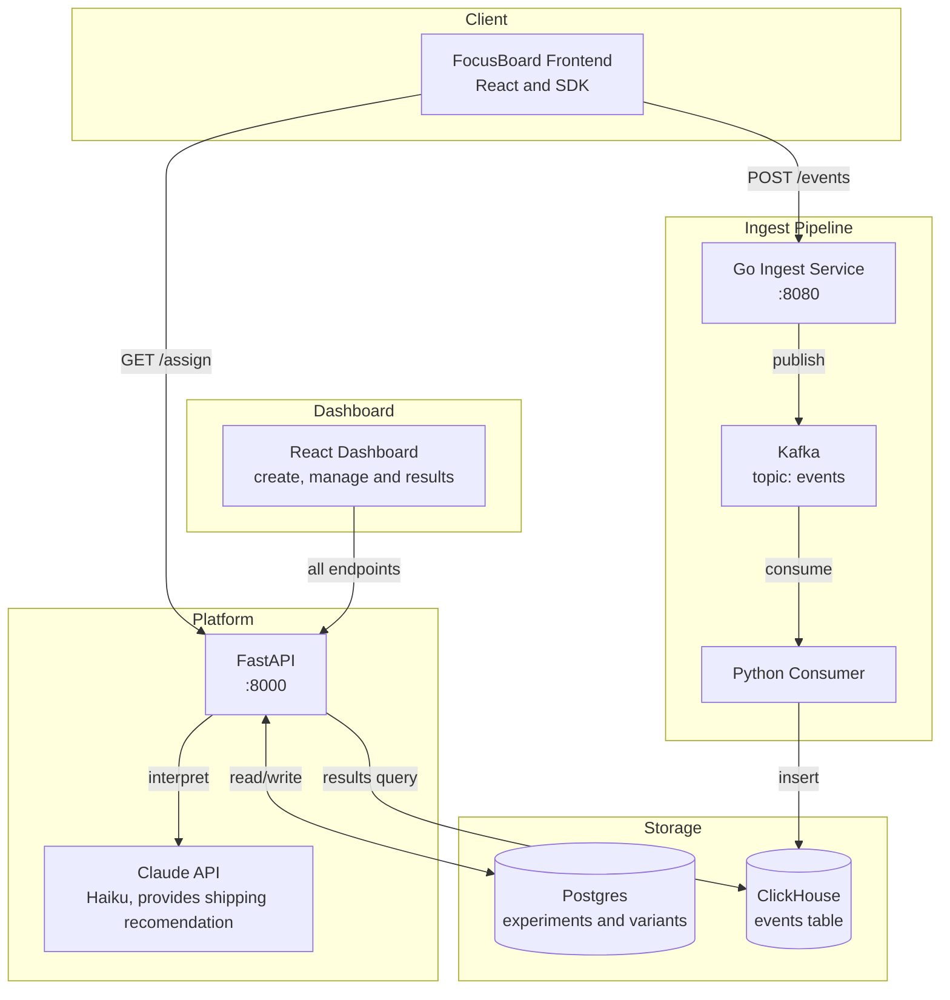

# AB Platform
A self-serve A/B experimentation platform built from scratch. Any app can integrate from the SDK to run experiments,  assign users to variants, track events at scale, and view statistically-analyzed results from an Al interpretation layer using Claude API.

Built to demonstrate distributed systems design: event streaming with Kafka, columnar analytics with ClickHouse, statistical significance testing, and LLM integration.
## Architecture

Data Flow: 
1. A user loads FocusBoard —> the SDK calls /assign to bucket them into a variant. A user will always get the same variant.
2. The SDK fires an exposure event to the Go ingest service, which validates and publishes it to Kafka
3. The Python consumer reads from Kafka and writes to ClickHouse
4. When the user converts based on the experiment criteria (I configured it to where the logs in or creates a habit), the SDK fires a conversion event through the same pipeline in #2
5. The dashboard queries FastAPI for the results, including Postgres for variant metadata, and ClickHouse for event counts.
6. Claude interprets the statistical results and returns a simple language recommendation on whether to ship or not

## Services
| Service | Language | Port | Description |
|---|---|---|---|
| `services/api` | Python / FastAPI | 8000 | Experiments CRUD, user assignment, results, and AI interpretation |
| `services/ingest` | Go | 8080 | event ingestion that publishes to Kafka |
| `services/consumer` | Python | — | Kafka consumer that writes events to ClickHouse |
| `services/dashboard` | React / TypeScript | 5173 | experiment management UI |
| `packages/sdk` | TypeScript | — | Client SDK for assignment and event tracking |

## Tech Stack
FastAPI — async Python API, chosen for native async support with asyncpg
Go — ingest service, chosen for performance and low memory use on high volume event writes
Kafka — acts as a queue so the ingest service never blocks waiting for ClickHouse
ClickHouse — columnar database that is made to efficiently store billions of events
Postgres — relational database that stores experiments and variants
Dashboard UI - composed of React, TypeScript, and Tailwind 
SciPy — chi-squared test for statistical significance (p < 0.05)
Claude API (Haiku) — AI result interpretation

## Running Locally
todo

## How It Works
todo
## SDK Usage
todo
